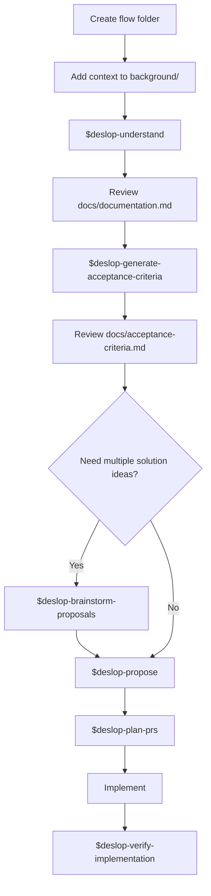

# Deslop

Deslop is a workflow for turning an unclear idea into an implementable and verifiable proposal. It is designed for brownfield work: start with messy context, document the real problem, define acceptance criteria, compare or choose an approach, plan the implementation, and verify the result.

Each Deslop run lives in a flow folder. The folder is the unit of work.

```txt
<project>/<flows-container>/<flow-name>/
  background/
  docs/
  proposals/
  plan/
```

## Workflow



## Skills

- `$deslop-help`: Explains the Deslop workflow.
- `$deslop-understand`: Reads `background/` and creates `docs/documentation.md`.
- `$deslop-generate-acceptance-criteria`: Turns `docs/documentation.md` into `docs/acceptance-criteria.md`.
- `$deslop-brainstorm-proposals`: Generates brief solution directions for comparison. Defaults to 5 ideas unless a count is specified.
- `$deslop-propose`: Creates one decision-ready proposal under `proposals/`.
- `$deslop-plan-prs`: Converts a completed proposal into a PR-by-PR execution plan under `plan/`.
- `$deslop-verify-implementation`: Checks completed implementation code against the proposal, documentation, and acceptance criteria.

## Typical Usage

1. Create a flow folder, for example:

   ```txt
   flows/improve-onboarding/
   ```

2. Put initial context in `background/`: notes, requirements, bug reports, screenshots, current behavior, prior decisions, constraints, or any other useful material.

3. Build shared understanding:

   ```txt
   $deslop-understand flows/improve-onboarding
   ```

   This creates `docs/documentation.md`.

4. Review `docs/documentation.md`. Resolve missing decisions or ambiguities before moving forward.

5. Generate acceptance criteria:

   ```txt
   $deslop-generate-acceptance-criteria flows/improve-onboarding
   ```

   This creates `docs/acceptance-criteria.md`.

6. Optionally brainstorm solution directions:

   ```txt
   $deslop-brainstorm-proposals flows/improve-onboarding
   ```

7. Create a decision-ready proposal:

   ```txt
   $deslop-propose flows/improve-onboarding
   ```

   You can include a preferred direction in the invocation if one of the brainstormed ideas should guide the proposal.

8. Plan implementation as PRs:

   ```txt
   $deslop-plan-prs flows/improve-onboarding
   ```

9. Implement the plan. Deslop does not require a specific implementation skill for this stage.

10. Verify the completed work:

    ```txt
    $deslop-verify-implementation flows/improve-onboarding
    ```

## Notes

- Always pass an explicit flow folder path to Deslop skills.
- Keep background material inside `background/` so later stages can trace decisions back to source context.
- Review generated documentation and acceptance criteria before proposals; later stages assume those files are accurate.
- If there is more than one proposal, specify which proposal should be planned or verified.
