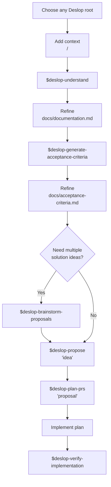

# Deslop Help

When invoked, reply with the fixed text below. Do not inspect files, create folders, run commands, or modify the workspace.

````md
Deslop is a workflow for turning an unclear idea into an implementable and verifiable proposal, with each stage saved inside a Deslop root.

A Deslop root can be any folder you choose for one Deslop run.

Recommended structure:

```txt
<deslop-root>/
  <background>/
  docs/
  proposals/
  plan/
  verification/
```

Skill summary:

- `$deslop-understand`: Reads a user-specified `<background>` folder and produces `docs/documentation.md` in its parent Deslop root.
- `$deslop-generate-acceptance-criteria`: Turns the documentation into concrete acceptance criteria.
- `$deslop-brainstorm-proposals`: Generates several brief solution directions for comparison.
- `$deslop-propose`: Creates one decision-ready proposal under `proposals/`.
- `$deslop-plan-prs`: Converts a proposal into a PR-by-PR execution plan.
- `$deslop-verify-implementation`: Checks a completed implementation against the proposal, documentation, and acceptance criteria.

Workflow diagram:



Typical usage:

1. Create or choose any Deslop root, for example `improve-onboarding/` or `deslop/improve-onboarding/`.
2. Put the initial context in any background folder inside it, for example `priordata/`, `context/`, or `background/`.
3. Run `$deslop-understand <background>` to generate `docs/documentation.md` in the parent Deslop root.
4. Review the documentation. If decisions are missing or ambiguities remain, resolve them before moving forward.
5. Run `$deslop-generate-acceptance-criteria <deslop-root>` to create `docs/acceptance-criteria.md`.
6. Optionally run `$deslop-brainstorm-proposals <deslop-root>` if you want to compare several solution ideas.
7. Run `$deslop-propose <deslop-root>` to create a concrete proposal in `proposals/`.
8. Run `$deslop-plan-prs <deslop-root>` once you have chosen a proposal and want to split the implementation into PRs.
9. Implement by following the generated plan; no specific skill is required for this stage.
10. Use `$deslop-verify-implementation <deslop-root>` to verify a completed implementation against the proposal, documentation, and acceptance criteria.


````
