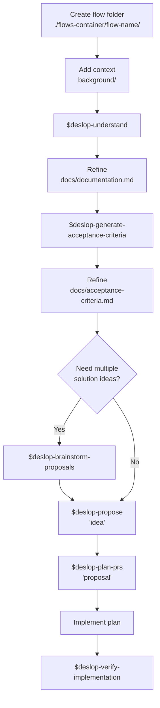

# Deslop Help

When invoked, reply with the fixed text below. Do not inspect files, create folders, run commands, or modify the workspace.

````md
Deslop is a workflow for turning an unclear idea into an implementable and verifiable proposal, with each stage saved inside a flow folder.

Recommended structure:

```txt
<project>/<flows-container>/<flow-name>/
  background/
  docs/
  proposals/
  plan/
```

Skill summary:

- `$deslop-understand`: Reads background/ and produces `docs/documentation.md`.
- `$deslop-generate-acceptance-criteria`: Turns the documentation into concrete acceptance criteria.
- `$deslop-brainstorm-proposals`: Generates several brief solution directions for comparison.
- `$deslop-propose`: Creates one decision-ready proposal under `proposals/`.
- `$deslop-plan-prs`: Converts a proposal into a PR-by-PR execution plan.
- `$deslop-verify-implementation`: Checks a completed implementation against the proposal, documentation, and acceptance criteria.

Workflow diagram:



Typical usage:

1. Create a flow folder, for example `flows/improve-onboarding/`.
2. Put the initial context in `background/`: notes, requirements, problems, screenshots, prior decisions, or any other relevant material.
3. Run `$deslop-understand <flow-folder>` to generate `docs/documentation.md`.
4. Review the documentation. If decisions are missing or ambiguities remain, resolve them before moving forward.
5. Run `$deslop-generate-acceptance-criteria <flow-folder>` to create `docs/acceptance-criteria.md`.
6. Optionally run `$deslop-brainstorm-proposals <flow-folder>` if you want to compare several solution ideas.
7. Run `$deslop-propose <flow-folder>` to create a concrete proposal in `proposals/`.
8. Run `$deslop-plan-prs <flow-folder>` once you have chosen a proposal and want to split the implementation into PRs.
9. Implement by following the generated plan; no specific skill is required for this stage.
10. Use `$deslop-verify-implementation <flow-folder>` to verify a completed implementation against the proposal, documentation, and acceptance criteria.


````
